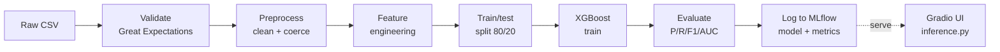

<div align="center">

# Telco Customer Churn Prediction

**End-to-end ML pipeline — from raw CSV to a live Gradio web app.**


</div>

---

## At a glance

> A production-style ML project on the [IBM Telco Customer Churn](https://www.kaggle.com/datasets/blastchar/telco-customer-churn) dataset.
> It builds, validates, tunes, tracks, and serves an XGBoost churn model —
> with a one-click Gradio UI for ad-hoc predictions.

|              |                                                                       |
| :----------- | :-------------------------------------------------------------------- |
| **Dataset**  | IBM Telco Customer Churn (7,043 customers × 21 features)              |
| **Model**    | XGBoost with `scale_pos_weight` for class imbalance                   |
| **Threshold**| 0.35 — tuned for recall (catching churners > avoiding false alarms)   |
| **Tracking** | MLflow (local file store)                                             |
| **Tuning**   | Optuna (Bayesian search over 5 hyperparameters)                       |
| **Validation**| Great Expectations                                                   |
| **Serving**  | Gradio web UI + reusable inference module                             |

---

## Model performance

XGBoost · threshold = 0.35 · stratified 80/20 split

| Metric    |   Score    |
| :-------- | :--------: |
| ROC-AUC   | **0.8367** |
| Recall    | **0.8209** |
| Precision |   0.4904   |
| F1        |   0.6140   |
| Accuracy  |   0.7260   |

> **Why recall?** Letting a churner walk silently costs more than mailing a retention
> offer to a customer who would've stayed. The model intentionally over-flags —
> false positives are cheap, false negatives are lost revenue.

---

## Quick start

```bash
# 1. set up the environment
python3 -m venv .venv
source .venv/bin/activate
pip install -r requirements.txt

# 2. run the full training pipeline (logs to mlruns/)
python scripts/run_pipeline.py --input data/raw/WA_Fn-UseC_-Telco-Customer-Churn.csv

# 3. launch the prediction UI
python src/app/app.py
#    -> http://127.0.0.1:7860

# 4. browse experiment runs (optional)
mlflow ui --backend-store-uri ./mlruns
```

Pipeline flags: `--target`, `--threshold`, `--test_size`, `--experiment`, `--mlflow_uri`.
Run with `--help` for details.

---

## Pipeline architecture



`scripts/run_pipeline.py` runs all seven stages inside a single MLflow run.

<details>
<summary><b>Stage-by-stage breakdown</b></summary>

1. **Data loading & validation** — load CSV; run Great Expectations checks (schema, allowed category values, numeric ranges, cross-column consistency). A failed expectation aborts the run and logs the failure to MLflow.
2. **Preprocessing** — strip columns, drop IDs, coerce `TotalCharges` to numeric, map `Churn` to 0/1, fill numeric NaNs.
3. **Feature engineering** — binary-encode 2-value cols, one-hot encode multi-category cols with `drop_first=True`. Saves `feature_columns.json` + `preprocessing.pkl` for the serving pipeline.
4. **Train/test split** — stratified 80/20, `random_state=42`. Computes `scale_pos_weight = neg/pos` for XGBoost class balancing.
5. **Model training** — XGBoost with tuned hyperparameters; train time logged.
6. **Evaluation** — precision, recall, F1, ROC-AUC, classification report. All metrics logged to MLflow.
7. **Model serialization** — `mlflow.sklearn.log_model` for downstream serving.

</details>

---

## Project structure

```
telco-churn-prediction/
├── data/
│   ├── raw/              · original Kaggle CSV
│   └── processed/        · output of preprocess_data()
├── notebooks/            · EDA -> preprocessing -> modeling -> tuning
├── scripts/
│   └── run_pipeline.py   · end-to-end pipeline
├── src/
│   ├── data/             · load_data, preprocess_data
│   ├── features/         · build_features (binary + one-hot)
│   ├── models/           · train, tune, evaluate
│   ├── serving/          · inference (load model + predict)
│   ├── app/              · Gradio UI
│   └── utils/            · validate_data (Great Expectations)
├── artifacts/            · feature_columns.json, preprocessing.pkl
├── mlruns/               · MLflow tracking store (gitignored)
└── requirements.txt
```

---

## Stack

| Layer       | Tool                                |
| :---------- | :---------------------------------- |
| Modeling    | XGBoost, scikit-learn, LightGBM     |
| Tuning      | Optuna                              |
| Tracking    | MLflow                              |
| Validation  | Great Expectations                  |
| UI          | Gradio                              |
| Notebooks   | Jupyter (EDA, model selection, threshold tuning) |

---

## Known constraints

<details>
<summary><b>Environment gotchas</b></summary>

- `requirements.txt` pins `great_expectations==1.5.8`, but `src/utils/validate_data.py` uses the legacy `ge.dataset.PandasDataset` API removed in 1.x. Use `great_expectations<0.18` until the validator is migrated to the v1 Expectation Suite API.
- `mlflow==2.14.1` imports `pkg_resources`, which is no longer bundled in `setuptools>=81`. Pin `setuptools<80` if you hit `ModuleNotFoundError: pkg_resources`.
- `mlruns/` is gitignored. Run the pipeline at least once before launching the UI — `inference.py` looks for the most recently modified model under `mlruns/*/*/artifacts/model`.

</details>

---

## Dataset

[Telco Customer Churn](https://www.kaggle.com/datasets/blastchar/telco-customer-churn) —
7,043 customers × 21 features, originally published by IBM. Drop the file at
`data/raw/WA_Fn-UseC_-Telco-Customer-Churn.csv`.

---

<div align="center">
<sub>Built end-to-end as a portfolio project. Feedback and PRs welcome.</sub>
</div>
